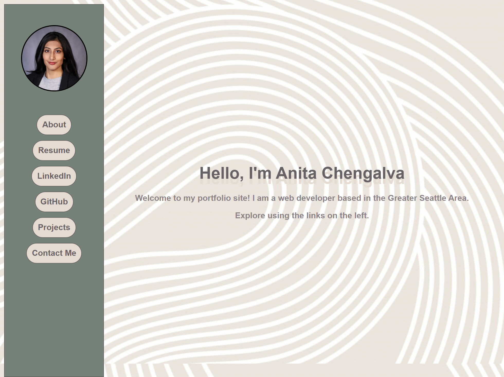
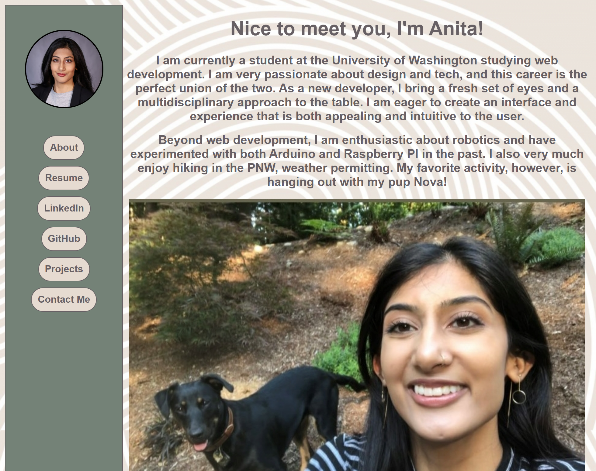
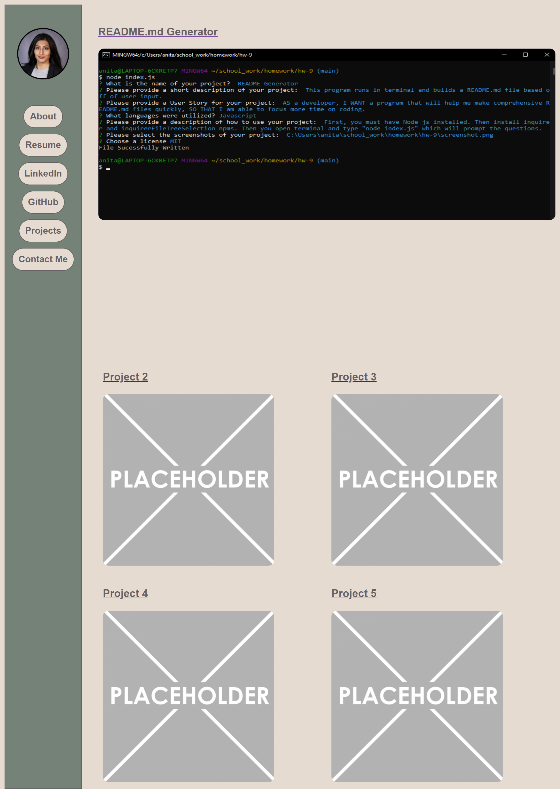
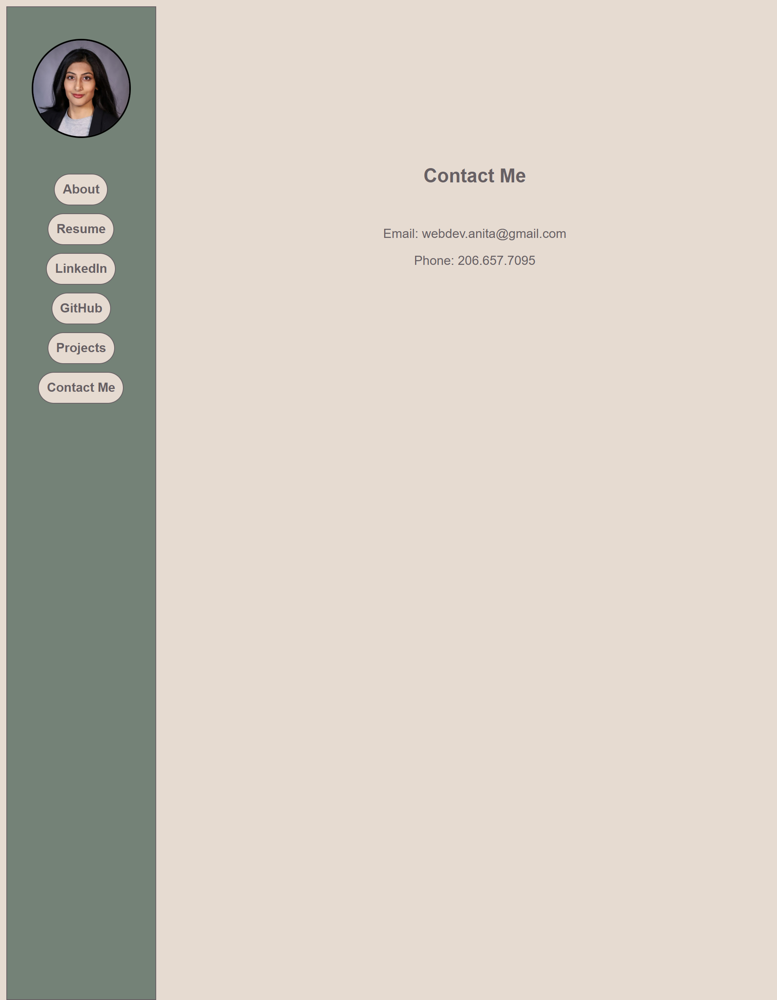

# PORTFOLIO

## Link

live deployed link: https://anitachengalva.github.io/portfolio/

## Description

In this project, I worked in HTML and CSS.
Within CSS, flexbox has been incredibly useful in formatting my page layouts.

This portfolio is a webpage with a vertical, left-side navigation bar.
It provides convenient access to my bio, resume, LinkedIn, GitHub, examples of my work, & contact info all in one place.

## User Story

AS AN employer  
I WANT to view a potential employee's deployed portfolio of work samples  
SO THAT I can review samples of their work and assess whether they're a good candidate for an open position  

## Screenshots

Main Page

About Me Page

Projects Page

Contact Page

## Contact Me

Thank you for checking out this README! If you have any questions, contact me at 
webdev.anita@gmail.com

## GitHub

https://github.com/anitachengalva

## License

This project is licensed under the MIT License.
